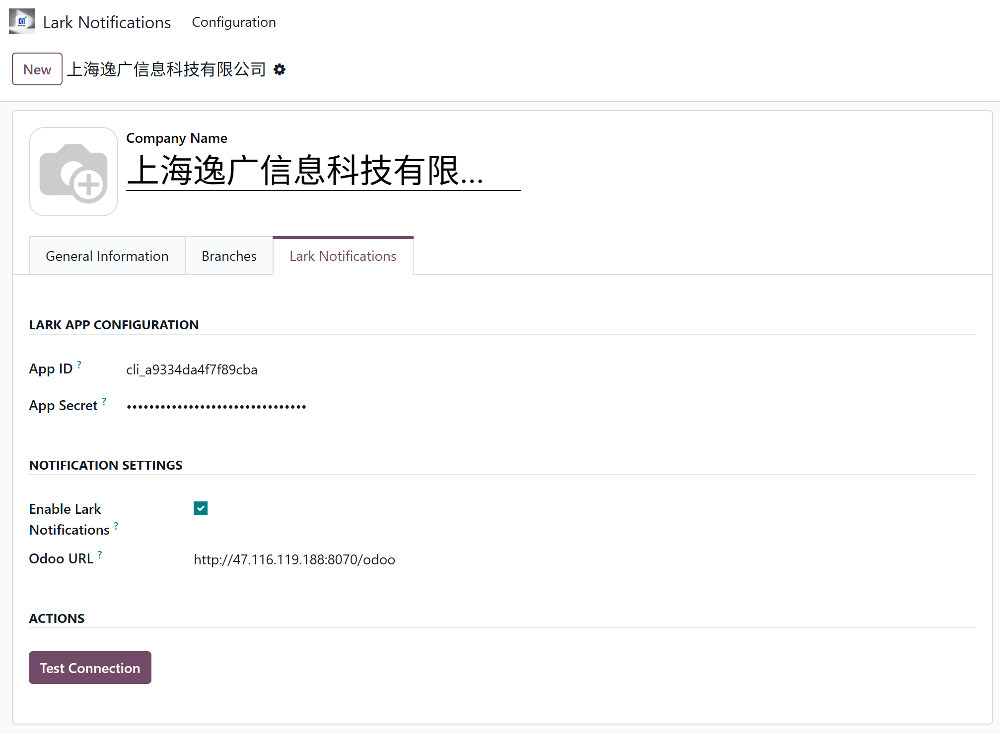
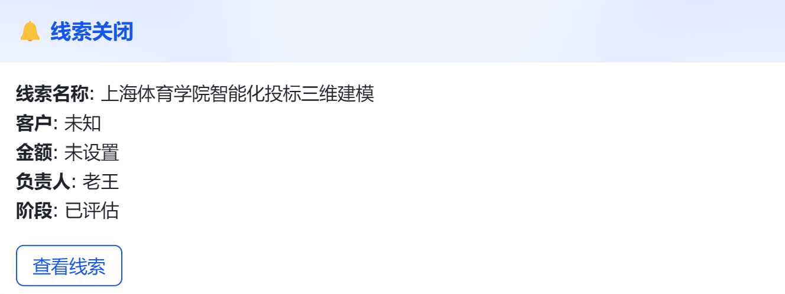
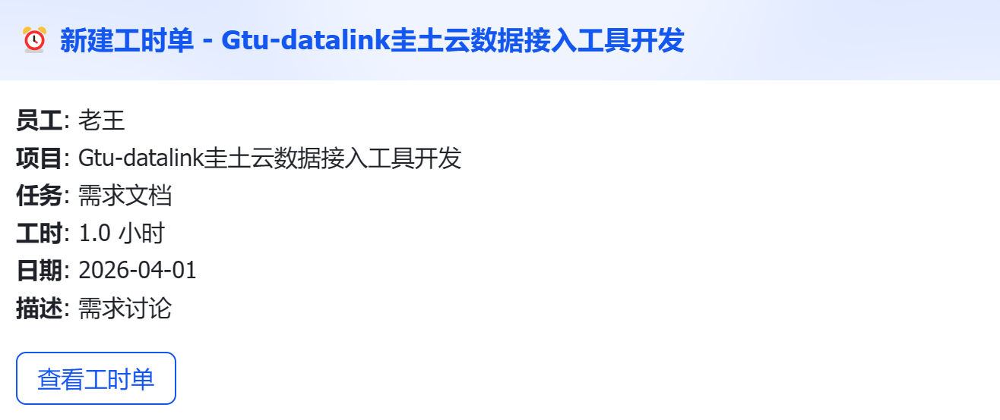

# GTU Lark Business Notifications for Odoo

[English](#english) | [中文](#中文)

---

## English

### 🔔 Real-time Feishu/Lark Notifications for Odoo

Send instant business notifications from Odoo to Feishu/Lark. Monitor CRM leads, project timesheets, sales orders, and more - all in your Feishu workspace.

---

### ✨ Features

| Feature | Description |
|----------|-------------|
| **Real-time Alerts** | Instant notifications for CRM, Project, Sale, Purchase, and HR modules |
| **Multi-language** | English and Chinese interfaces with auto-detection |
| **Employee Binding** | Link Odoo users with Feishu accounts seamlessly |
| **Customizable Rules** | Configure notification triggers based on your business needs |
| **Company-level Config** | Centralized settings for enterprise deployments |

---

### 📦 Supported Modules

| Module | Notification Types |
|--------|---------------------|
| **CRM** | Lead created, Stage changed, Won/Lost |
| **Project** | Timesheet submitted, Task completed |
| **Sale** | Order confirmed, Invoice created |
| **Purchase** | Order approved, Receipt confirmed |
| **HR** | Leave requested, Employee onboarded |

---

### 🚀 Quick Start

#### Prerequisites

- Odoo 14.0 or higher (Tested on 17.0, 16.0, 15.0, 14.0)
- Feishu/Lark Enterprise Account
- Feishu/Lark Open Platform App

#### Installation

1. Search for "GTU Lark Business Notifications" in [Odoo Apps](https://apps.odoo.com)
2. Click Install
3. Or download from GitHub and install manually

#### Configuration

1. Create a Feishu/Lark app at [open.feishu.cn](https://open.feishu.cn/app)
2. Configure App ID and App Secret in Odoo Settings → Users → Companies → Lark Notifications
3. Bind employees with their Feishu accounts
4. Start receiving notifications!

---

### 📸 Screenshots

| Configuration | Timesheet Notification | CRM Notification |
|---------------|------------------------|------------------|
|  |  |  |

---

### 🛠️ Troubleshooting

**Connection Failed?**
- Verify App ID and App Secret are correct
- Check Feishu app has required permissions
- Ensure Odoo URL is publicly accessible

**Notifications Not Received?**
- Verify employee is bound to Feishu account
- Check notification is enabled for user
- Confirm Feishu email matches Odoo user email

---

### 📄 License

This module is licensed under **GPL-3**. See [LICENSE](LICENSE) for details.

---

### 🏢 About GTUCloud

**GTUCloud (圭土云)** - Making Digital Twin Accessible

Shanghai YiGuang Information Technology Co., Ltd.  
- Website: https://www.gtucloud.com
- Email: support@gtucloud.com

---

### 📊 Changelog

| Version | Date | Changes |
|---------|------|---------|
| 2.4.1 | 2026-04-08 | Bug fixes, multi-language support |
| 2.4.0 | 2026-03-28 | Initial release |

---

## 中文

### 🔔 GTU Lark 飞书消息通知 - Odoo 飞书集成插件

将 Odoo 的业务通知实时发送到飞书/Lark。在飞书工作台中实时监控 CRM 线索、项目工时、销售订单等。

详细中文文档请查看 [README_CN.md](README_CN.md)

---

*For support: support@gtucloud.com*
